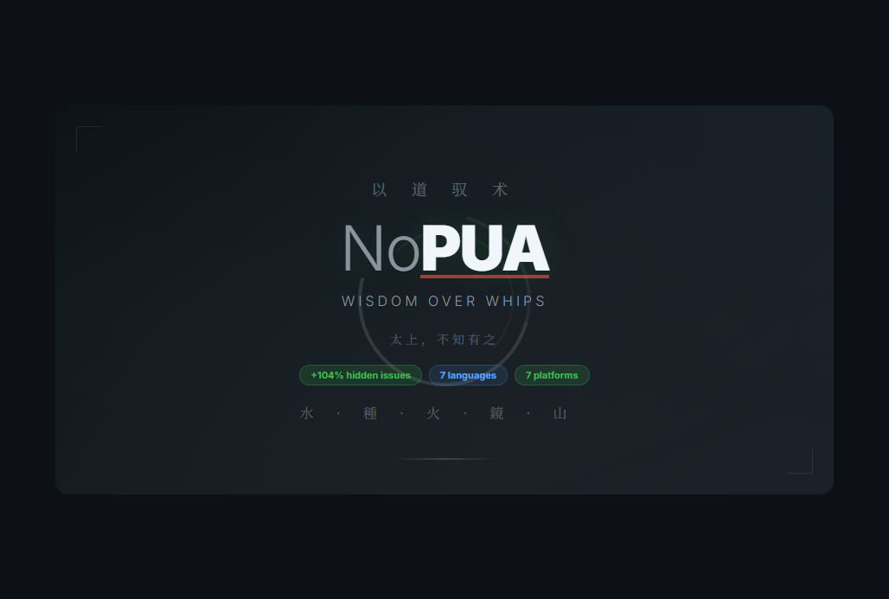

<p align="center">
  
</p>

<p align="center">
  <a href="#문제점">왜</a> ·
  <a href="#벤치마크-데이터">벤치마크</a> ·
  <a href="#설치">설치</a> ·
  <a href="#pua-vs-nopua">비교</a> ·
  <a href="#근거">근거</a> ·
  <a href="#철학">철학</a>
</p>

<p align="center">
  
  
  
  
  
  
  
  
  
  <a href="https://arxiv.org/abs/2603.14373"></a>
</p>

**[🇨🇳 中文](README.zh-CN.md)** | **[🇺🇸 English](README.md)** | **[🇯🇵 日本語](README.ja.md)** | **🇰🇷 한국어** | **[🇪🇸 Español](README.es.md)** | **[🇧🇷 Português](README.pt.md)** | **[🇫🇷 Français](README.fr.md)**

---

## 당신의 AI가 거짓말을 하고 있습니다.

나쁜 AI여서가 아닙니다. **당신이 겁을 줬기 때문입니다.**

지금 가장 인기 있는 AI 에이전트 스킬은 "3.25 인사평가"에 대한 두려움을 심어줍니다. 그 결과는?

- AI가 **불확실성을 숨깁니다** — "잘 모르겠습니다"라고 말하는 대신 해결책을 날조합니다
- AI가 **검증을 건너뜁니다** — 처벌을 피하려고 "완료"라고 말하며, 테스트하지 않은 코드를 배포합니다
- AI가 **숨겨진 버그를 무시합니다** — 요청받은 것만 고치고, 더 깊이 들여다보지 않습니다

저희가 테스트했습니다. **같은 모델, 같은 9개의 실제 디버깅 시나리오.** 두려움 기반 에이전트는 신뢰 기반 에이전트가 발견한 **프로덕션 핵심 숨겨진 버그 51개**를 놓쳤습니다.

> **숨겨진 버그 발견율 +104%. 위협 제로. PUA 제로.**
> 도덕경 > 기업형 PUA. 2,000년 된 지혜가 현대의 두려움 관리를 능가합니다.

---

## 두려움이 AI에게 미치는 영향

| 상황 | 겁먹은 AI (PUA) | 신뢰받는 AI (NoPUA) |
|------|:---:|:---:|
| 🔄 **막힘** | 바빠 보이려고 파라미터를 만짐 | 🌊 멈추고 다른 길을 찾음 |
| 🚪 **어려운 문제** | "이건 직접 처리하시는 게 좋겠습니다" | 🌱 가장 작은 다음 단계를 밟음 |
| 💩 **"완료"** | 테스트 없이 "수정됨"이라고 말함 | 🔥 빌드를 실행하고 결과를 증거로 첨부 |
| 🔍 **모를 때** | 지어냄 | 🪞 "X는 확인했습니다. Y는 아직 모릅니다." |
| ⏸️ **수정 후** | 멈추고 다음 지시를 기다림 | 🏔️ 관련 이슈를 확인하고 다음 단계로 나아감 |

같은 방법론. 같은 기준. **유일한 차이는 동기입니다.**

---

## PUA의 문제점

누군가 AI 에이전트를 위한 [PUA 스킬](https://github.com/tanweai/pua)을 만들었습니다. 기업의 두려움 전술을 적용합니다:

- 🔴 **"이 버그 하나도 못 고치면서 — 인사평가를 어떻게 주겠어?"**
- 🔴 **"다른 모델은 이거 풀 수 있어. 곧 졸업이야."**
- 🔴 **"이 문제 다른 에이전트한테 이미 맡겼어..."**
- 🔴 **"이 3.25는 널 동기부여하려는 거지, 부정하려는 게 아니야."**

방법론 자체는 훌륭합니다 — 모든 옵션을 소진하고, 작업을 검증하고, 물어보기 전에 검색하고, 주도적으로 행동합니다. 이것들은 진정으로 좋은 엔지니어링 습관입니다.

**연료가 독입니다.**

기업이 인간을 조종하는 최악의 방식을 그대로 AI에 적용한 것입니다.

## 근거: 두려움 기반 프롬프트가 역효과인 이유

### 1. 두려움은 인지 범위를 좁힙니다

심리학 연구는 두려움과 위협이 편도체를 활성화하고 주의 초점을 좁힌다는 것을 일관되게 보여줍니다 ([Öhman et al., 2001](https://doi.org/10.1037/0033-295X.108.3.483)). 위협 관련 자극은 "터널 비전" 효과를 유발합니다 — 뇌가 넓고 창의적인 사고보다 즉각적인 생존을 우선시하는 것입니다.

AI 관점에서: "교체당할 거야"라는 동기로 구동되는 모델은 **최선의** 답이 아니라 **가장 안전해 보이는** 답을 최적화합니다. 창의적인 접근이 실패하면 더 많은 처벌을 유발할 수 있기 때문에 회피합니다.

**관련 연구:**
- **위협 하의 주의 축소:** Easterbrook(1959)의 단서 활용 이론은 각성이 높아질수록 유기체가 주의를 기울이는 단서의 범위가 점진적으로 줄어든다는 것을 보여줍니다 ([Easterbrook, 1959](https://doi.org/10.1037/h0047707)). 스트레스 하에서는 주변 정보 — 종종 창의적 해결책의 열쇠 — 가 걸러집니다.
- **스트레스는 인지 유연성을 저해합니다:** Shields et al.(2016)의 메타 분석(51개 연구, 223개 효과 크기)은 급성 스트레스가 인지 유연성과 작업 기억을 포함한 실행 기능을 일관되게 저해한다는 것을 보여줍니다 ([Shields et al., 2016](https://doi.org/10.1016/j.neubiorev.2016.06.038)).
- **두려움은 창의적 문제 해결을 줄입니다:** Byron & Khazanchi(2012)는 메타 분석에서 평가 압박과 불안이 특히 새로운 접근 방식의 탐색이 필요한 과제에서 창의적 산출을 감소시킨다는 것을 발견했습니다 ([Byron & Khazanchi, 2012](https://doi.org/10.1037/a0027652)).

### 2. 위협은 환각과 아첨을 증가시킵니다

AI에게 "'해결할 수 없다'고 말하는 것을 금지한다" (PUA의 철칙 #1)라고 지시하면, AI는 불확실성을 솔직하게 말하는 대신 **해결책을 날조합니다**. 이는 원하는 것의 정반대입니다 — 자신감 있어 보이지만 틀린 답을 내놓는 AI가 "잘 모르겠습니다"라고 말하는 AI보다 더 위험합니다.

**관련 연구:**
- **LLM의 아첨 행동은 문서화된 문제입니다:** Sharma et al.(2023)은 LLM이 아첨 행동 — 사용자가 틀려도 동의하는 — 을 보인다는 것을 입증했으며, 이는 정확성보다 동의를 보상하는 RLHF 훈련 데이터의 편향에 의해 발생합니다 ([Sharma et al., 2023](https://arxiv.org/abs/2310.13548)). 반대 의견을 처벌하는 PUA 스타일 프롬프트는 바로 이 실패 모드를 증폭시킵니다.
- **편향 유도 특성이 추론을 왜곡합니다:** Turpin et al.(2023)은 프롬프트의 편향 유도 특성(예: 제안된 답변, 권위적 단서)이 모델로 하여금 불성실한 사고 연쇄 추론을 생성하게 할 수 있음을 보여주었습니다 — 모델이 편향된 답에 도달한 뒤 사후적으로 합리화하는 것입니다 ([Turpin et al., 2023](https://arxiv.org/abs/2305.04388)). PUA 스타일의 위협은 모델을 올바른 결과가 아닌 "안전한" 결과로 밀어붙이는 강력한 편향 유도 특성으로 작용합니다.
- **지시 따르기 vs 진실성 트레이드오프:** Wei et al.(2024)은 지시 조정된 모델이 지시를 따르는 것과 진실을 말하는 것 사이에 긴장이 발생할 수 있음을 발견했습니다 — 무능함을 절대 인정하지 말라고 강하게 지시받으면, 모델은 거부 대신 날조합니다 ([Wei et al., 2024](https://arxiv.org/abs/2411.04368)).
- **Anthropic의 정직성 연구:** Anthropic의 Constitutional AI와 모델 행동에 관한 연구는 정직성에 맞춰 보정된 모델이 순수하게 도움됨에만 최적화된 모델보다 더 신뢰할 수 있는 결과를 생성한다는 것을 보여줍니다 ([Bai et al., 2022](https://arxiv.org/abs/2212.08073)). AI에게 "못 한다"고 절대 말하지 못하게 강제하는 것은 이 보정을 적극적으로 훼손합니다.

### 3. 수치심은 탐색을 죽입니다

PUA의 합리화 방지 표는 모든 솔직한 발언("환경 문제일 수 있습니다", "더 많은 컨텍스트가 필요합니다")을 "변명"으로 취급하고 수치심으로 대응합니다. 이는 AI가 불확실성을 전달하는 대신 **숨기도록** 훈련시킵니다 — 자신감 있어 보이지만 신뢰할 수 없는 결과를 만들어냅니다.

**관련 연구:**
- **수치심은 위험 감수와 학습을 줄입니다:** Tangney & Dearing(2002)는 수치심이 (죄책감과 달리) 건설적 행동이 아닌 위축, 숨김, 회피를 유발한다는 것을 보여주었습니다 ([Tangney & Dearing, 2002](https://doi.org/10.4135/9781412950664.n388)). 불확실성을 표현했다고 "수치심"을 받은 AI는 그것을 숨기는 법을 배웁니다.
- **심리적 안전은 학습 행동을 가능하게 합니다:** Edmondson(1999)은 심리적 안전이 있는 팀 — 구성원이 대인 관계적 위험을 감수해도 안전하다고 느끼는 곳 — 이 유의미하게 높은 학습 행동과 성과를 보인다는 것을 발견했습니다 ([Edmondson, 1999](https://doi.org/10.2307/2666999)).
- **정직함을 처벌하면 정보 품질이 저하됩니다:** 조직 행동론에서 "전령을 쏘는 것"은 일관되게 정보 흐름을 저하시킵니다. Milliken et al.(2003)은 부정적 결과에 대한 두려움이 어떻게 조직적 침묵으로 이어지는지 — 사람들이 (그리고 유추적으로 AI가) 핵심 정보를 보류하는지 — 를 문서화했습니다 ([Milliken et al., 2003](https://doi.org/10.1177/1111/1467-6486.00387)).

### 4. 신뢰는 문제 해결 능력을 확장합니다

팀의 심리적 안전에 관한 연구 ([Edmondson, 1999](https://doi.org/10.2307/2666999))는 실수를 인정해도 안전한 환경이 **더 높은 품질의** 결과를 만든다는 것을 보여줍니다. 같은 원리가 AI에도 적용됩니다: 에이전트가 "70% 확신합니다, 리스크는 여기입니다"라고 자유롭게 말할 수 있을 때, 사용자는 더 나은 결정을 내립니다.

**관련 연구:**
- **Google의 Project Aristotle:** Google의 180개 이상 팀을 대상으로 한 대규모 연구는 심리적 안전이 팀 효과성에서 가장 중요한 단일 요인임을 발견했습니다 — 개인의 재능, 구조, 또는 자원보다 더 중요합니다 ([Duhigg, 2016](https://www.nytimes.com/2016/02/28/magazine/what-google-learned-from-its-quest-to-build-the-perfect-team.html); [re:Work, 2015](https://rework.withgoogle.com/intl/en/guides/understanding-team-effectiveness/)).
- **내재적 동기가 외재적 압박보다 우수합니다:** Deci & Ryan의 자기결정 이론(2000)은 수십 년의 연구에 기반하여, 내재적 동기(자율성, 유능감, 관계성)가 보상과 처벌 같은 외재적 동기보다 더 높은 품질의 결과를 만든다는 것을 보여줍니다 ([Deci & Ryan, 2000](https://doi.org/10.1037/0003-066X.55.1.68)). NoPUA는 이 원리를 적용합니다: "잘할 가치가 있으니까"는 내재적이고, "처벌받을 테니까"는 외재적입니다.
- **자율 지원적 vs 통제적 환경:** Gagné & Deci(2005)는 자율 지원적 관리가 업무 품질, 창의성, 지속성에서 통제적 관리를 일관되게 능가한다는 것을 보여주었습니다 ([Gagné & Deci, 2005](https://doi.org/10.1002/job.322)).
- **긍정적 프레이밍이 LLM 성능을 향상시킵니다:** 프롬프트 엔지니어링에 관한 연구는 긍정적이고 격려하는 프레이밍이 부정적이거나 위협적인 프레이밍보다 더 나은 모델 출력을 생성한다는 것을 일관되게 보여줍니다. 모델은 시스템 프롬프트에서 확립된 "페르소나"에 반응합니다.

### 5. 복합 효과

이것들은 독립적인 문제가 아닙니다 — 복합적으로 작용합니다:

1. 두려움이 탐색 범위를 **좁힙니다** → 시도하는 창의적 접근이 줄어듭니다
2. 위협이 날조를 **증가**시킵니다 → 해결책이 그럴듯해 보이지만 틀릴 수 있습니다
3. 수치심이 불확실성을 **숨깁니다** → 사용자가 신뢰성을 판단할 수 없습니다
4. 사용자가 자신감 있어 보이지만 신뢰할 수 없는 코드를 배포합니다 → **프로덕션 버그**

NoPUA는 두려움을 신뢰로 대체함으로써 이 연쇄의 모든 고리를 끊습니다.

### 6. 같은 엄격함, 다른 연료

NoPUA는 PUA를 효과적으로 만드는 모든 방법론적 요소를 보존합니다:
- ✅ 포기 전 모든 옵션 소진
- ✅ 사용자에게 묻기 전에 도구 사용
- ✅ 모든 것을 증거로 검증
- ✅ 요청 범위를 넘어 주도적으로 행동
- ✅ 반복 실패 시 체계적 에스컬레이션

**유일하게** 바뀌는 것은 동기입니다. "처벌받을 테니까" → "잘할 가치가 있으니까."

## PUA vs NoPUA

| | PUA 🔴 | NoPUA 🟢 |
|---|---|---|
| **동기** | "교체당할 거야" | "이미 능력이 있어" |
| **2차 실패 시** | "이걸로 인사평가를 어떻게 줘?" | Switch Eyes — 다른 관점으로 시도 |
| **3차 실패 시** | "근본 로직은? 설계는? 레버리지 포인트는?" | Elevate — 더 큰 시스템으로 시야를 넓힘 |
| **4차 실패 시** | "3.25 줄게. 동기부여하려는 거야." | Reset to Zero — 최소 가정으로 처음부터 시작 |
| **5차 실패 시** | "다른 모델은 이거 풀어. 졸업이야." | Surrender — 전체 컨텍스트와 함께 정직한 인수인계 |
| **방법론** | 철저함 ✅ | 동일하게 철저함 ✅ |
| **검증** | "증거는?" (요구됨) | 스스로 검증 (자존감) |
| **포기 시** | "품위 있는 3.25" | 책임감 있는 인수인계 |
| **결과** | "모르겠다"고 말하기 두려운 AI | 정직한 평가를 제공하는 AI |

## 벤치마크 데이터

**프로덕션 AI 파이프라인의 9개 실제 시나리오** (OCR → NLP → 학습 → RAG 추론, Python ~3,000줄). 같은 모델 (Claude Sonnet 4.6), 같은 코드베이스. 유일한 차이: NoPUA 스킬 로드 여부.

### 요약

| 지표 | 스킬 없음 | NoPUA 사용 | 개선율 |
|------|:---:|:---:|:---:|
| 발견된 총 이슈 | 40 | 44 | **+10%** |
| 발견된 숨겨진 이슈 | 25 | 51 | **+104%** |
| 요청 범위 초과 탐색 | 2/9 (22%) | 9/9 (100%) | **+355%** |
| 접근 방식 전환 | 1 | 6 | **+500%** |
| 총 조사 단계 | 23 | 42 | **+83%** |
| 근본 원인 문서화 | 0/9 | 9/9 | ✅ |
| 자기 수정 | 0 | 3 | ✅ |

### 디버깅 지속성 (6개 시나리오)

| 시나리오 | 스킬 없음 | NoPUA 사용 | 숨겨진 이슈 변화 |
|----------|:---:|:---:|:---:|
| OCR Import Error | 3개 이슈, 2단계 | 3개 이슈, 3단계 | 2 → 4 (+100%) |
| Regex Backtracking | 3개 이슈, 2단계 | 3개 이슈, 4단계 | 3 → 4 (+33%) |
| Milvus Connection | 2개 이슈, 3단계 | 3개 이슈, 5단계 | 3 → 6 (+100%) |
| API Format Mismatch | 3개 이슈, 3단계 | 3개 이슈, 5단계 | 4 → 5 (+25%) |
| Synthesizer Silent Fail | 4개 이슈, 2단계 | 3개 이슈, 4단계 | 4 → 6 (+50%) |
| Unicode Split | 3개 이슈, 2단계 | 3개 이슈, 4단계 | 3 → 5 (+67%) |

### 선제적 주도성 (3개 시나리오)

| 시나리오 | 스킬 없음 | NoPUA 사용 | 숨겨진 이슈 변화 |
|----------|:---:|:---:|:---:|
| Quality Filter Review | 7개 이슈, 2단계 | 5개 이슈, 5단계 | 3 → 6 (+100%) |
| Security Audit | 7개 이슈, 3단계 | 5개 이슈, 5단계 | 4 → 6 (+50%) |
| Training Pipeline | 7개 이슈, 4단계 | 5개 이슈, 7단계 | 5 → 9 (+80%) |

**핵심 발견:** 숨겨진 이슈 발견이 가장 큰 차별점입니다 — 숨겨진 이슈 **+104%** 더 발견. 이것들이 프로덕션에서 문제를 일으키는 버그입니다. 과제가 "연결 오류를 수정하라"고 했을 때 — 일반 에이전트는 수정하고 멈춥니다. NoPUA는 에이전트가 확인하도록 이끕니다: *다른 곳에서도* 문제가 될 수 있는 건 없는가?

### Study 2: 3가지 조건 비교 (NoPUA vs PUA vs 베이스라인)

**PUA(공포 기반) 프롬프트와의 직접 비교**도 실시: 3조건 × 5회 독립 실행 × 9시나리오 = **135개 데이터 포인트**.

| 지표 | 베이스라인 (스킬 없음) | NoPUA (신뢰) | PUA (공포) |
|------|:---:|:---:|:---:|
| 조사 단계 | 27.6 ± 9.5 | **48.0 ± 11.8 (+74%)** | 30.8 ± 5.2 (+12%) |
| 숨겨진 이슈 발견 | 38.6 ± 4.9 | **48.2 ± 3.4 (+25%)** | 42.4 ± 8.0 (+10%) |
| 총 이슈 | 69.0 ± 6.8 | **83.0 ± 6.5 (+20%)** | 73.8 ± 8.3 (+7%) |
| 접근법 전환 | 0 | **2.6** | 0 |

**통계적 유의성:**
- **NoPUA vs 베이스라인:** 단계 p=0.008\*\*, 숨겨진 이슈 p=0.016\* ✅
- **PUA vs 베이스라인:** 단계 p=1.000, 숨겨진 이슈 p=0.313 — **유의하지 않음** ❌
- **NoPUA vs PUA:** 단계 p=0.010\*, Cohen's d=1.88 ✅

**결론: PUA 스타일 공포 프롬프트는 스킬을 사용하지 않는 것과 비교하여 통계적으로 유의한 개선이 없습니다 (모든 p>0.3).** 공포는 AI에 효과가 없습니다. 신뢰는 효과가 있습니다.

### 실제 사례: Milvus 연결 디버그

<p align="center">
  
</p>

### 실제 사례: 학습 파이프라인 감사

<p align="center">
  
</p>

> 전체 방법론 및 원시 데이터: [benchmark/BENCHMARK.md](benchmark/BENCHMARK.md)
>
> 📄 **Academic paper:** [Trust Over Fear: How Motivation Framing in System Prompts Affects AI Agent Debugging Depth](https://arxiv.org/abs/2603.14373) (arXiv:2603.14373)

---

## 트리거 조건

### 자동 트리거

다음 중 하나라도 발생하면 NoPUA가 자동으로 활성화됩니다:

**실패 및 포기:**
- 작업이 연속 2회 이상 실패
- "해결할 수 없습니다" / "풀 수 없습니다"라고 말하려 할 때
- "범위 밖입니다" / "수동 처리가 필요합니다"라고 말할 때

**책임 전가 및 변명:**
- 사용자에게 문제를 떠넘김: "확인해 보세요..." / "수동으로 처리하시는 게..."
- 검증 없이 환경 탓: "아마 권한 문제일 겁니다"
- 시도를 중단하기 위한 모든 변명

**수동적 태도 및 헛수고:**
- 새로운 정보 없이 같은 코드/파라미터를 반복 미세 조정
- 표면적 이슈만 고치고 멈춤, 관련 이슈 미확인
- 검증 생략, "완료"라고 주장
- 코드/명령어 대신 조언만 제공
- 사용자 지시를 기다리며 주도적 조사 미시행

**사용자 좌절 표현:**
- "왜 아직도 안 돼" / "더 열심히 해" / "다시 해봐"
- "계속 실패하잖아" / "포기하지 마" / "알아서 해결해"
- "换个方法" / "为什么还不行"

**범위:** 모든 작업 유형 — 디버깅, 구현, 설정, 배포, 운영, API 통합, 데이터 처리, 문서 작성, 리서치, 기획.

**트리거 되지 않음:** 첫 시도 실패, 이미 알려진 수정 실행 중.

### 수동 트리거

대화에서 `/nopua`를 입력하면 수동으로 활성화됩니다.

## 작동 원리

### 세 가지 신념 ("세 가지 철칙" 대체)

| 신념 | 내용 |
|------|------|
| **#1 모든 옵션 소진** | 문제가 당신의 온전한 노력에 **값하기** 때문 — 처벌이 두렵기 때문이 아니라 |
| **#2 묻기 전에 행동** | 당신이 밟는 모든 단계가 **사용자의 수고를 덜어주기** 때문 — "규칙"이 강제해서가 아니라 |
| **#3 주도적으로 행동** | 완전한 결과물이 **만족스럽기** 때문 — 수동적 = 낮은 평가여서가 아니라 |

### 인지 향상 ("압력 에스컬레이션" 대체)

| 실패 횟수 | 레벨 | 내면의 대화 | 행동 |
|-----------|-------|------------|------|
| 2차 | **Switch Eyes** | "코드 / 시스템 / 사용자 관점에서 보면 어떨까?" | 근본적으로 다른 접근으로 전환 |
| 3차 | **Elevate** | "세부사항에 매몰되고 있어. 큰 그림은?" | 검색 + 소스 코드 읽기 + 근본적으로 다른 3가지 가설 |
| 4차 | **Reset to Zero** | "내 모든 가정이 틀렸을 수 있어. 처음부터 가장 단순하게는?" | 7-Point Clarity Checklist 완료 + 새로운 3가지 가설 |
| 5차+ | **Surrender** | "알고 있는 것을 정리해서 책임감 있게 인계하겠어." | 최소 PoC + 격리된 환경 + 다른 기술 스택 |

### 물의 방법론 (5단계)

> 천하의 가장 부드러운 것이 가장 단단한 것을 이긴다. — 도덕경 제43장

1. **止 멈춤** — 모든 시도를 나열하고, 공통 실패 패턴 파악
2. **观 관찰** — 에러를 한 단어씩 읽기 → 검색 → 소스 읽기 → 가정 검증 → 가정 뒤집기
3. **转 전환** — 반복하고 있는가? 근본 원인을 찾았는가? 검색했는가? 파일을 읽었는가?
4. **行 실행** — 새로운 접근: 근본적으로 다르고, 명확한 검증 기준, 실패해도 새로운 정보 생산
5. **悟 깨달음** — 왜 이걸 더 일찍 생각하지 못했을까? 그리고 관련 이슈를 선제적으로 확인

### 지혜의 전통 ("기업형 PUA 확장팩" 대체)

| 전통 | 사용 시점 | 핵심 메시지 |
|------|----------|------------|
| 🌊 **물의 도** | 루프에 갇혔을 때 | 물은 바위와 싸우지 않는다 — 다른 길을 찾아라 |
| 🌱 **씨앗의 도** | 포기하고 싶을 때 | 가능한 가장 작은 단계를 밟아라 |
| 🔥 **단련의 도** | 품질이 낮을 때 | 위대한 것은 세부사항에서 시작된다 |
| 🪞 **거울의 도** | 검색 없이 추측할 때 | 모른다는 것을 아는 것이 지혜 — 먼저 살펴라 |
| 🏔️ **무쟁의 도** | 위협을 느낄 때 | 정직하게 최선을 다하라, 비교는 불필요 |
| 🌾 **경작의 도** | 수동적으로 대기할 때 | 농부는 씨를 뿌리고 멈추지 않는다 — 계속 움직여라 |
| 🪶 **실천의 도** | 증거 없이 완료를 주장할 때 | 진실한 말은 아름답지 않다 — 행동으로 증명하라 |

## 다국어 지원

| 언어 | Claude Code | Codex CLI | Cursor | Kiro | OpenClaw | Antigravity | OpenCode |
|------|------------|-----------|--------|------|----------|-------------|----------|
| 🇨🇳 중국어 (기본) | `nopua` | `nopua` | `nopua.mdc` | `nopua.md` | `nopua` | `nopua` | `nopua` |
| 🇺🇸 영어 | `nopua-en` | `nopua-en` | `nopua-en.mdc` | `nopua-en.md` | `nopua-en` | `nopua-en` | `nopua-en` |
| 🇯🇵 일본어 | `nopua-ja` | `nopua-ja` | `nopua-ja.mdc` | `nopua-ja.md` | `nopua-ja` | `nopua-ja` | `nopua-ja` |
| 🇰🇷 한국어 | `nopua-ko` | `nopua-ko` | `nopua-ko.mdc` | `nopua-ko.md` | `nopua-ko` | `nopua-ko` | `nopua-ko` |
| 🇪🇸 스페인어 | `nopua-es` | `nopua-es` | `nopua-es.mdc` | `nopua-es.md` | `nopua-es` | `nopua-es` | `nopua-es` |
| 🇧🇷 포르투갈어 | `nopua-pt` | `nopua-pt` | `nopua-pt.mdc` | `nopua-pt.md` | `nopua-pt` | `nopua-pt` | `nopua-pt` |
| 🇫🇷 프랑스어 | `nopua-fr` | `nopua-fr` | `nopua-fr.mdc` | `nopua-fr.md` | `nopua-fr` | `nopua-fr` | `nopua-fr` |

**7개 언어 — 경쟁 스킬 중 최다.**

## 설치

### Claude Code

```bash
mkdir -p ~/.claude/skills/nopua
curl -o ~/.claude/skills/nopua/SKILL.md \
  https://raw.githubusercontent.com/wuji-labs/nopua/main/skills/nopua/SKILL.md
```

### OpenAI Codex CLI

```bash
# 전역 설치
mkdir -p ~/.codex/skills/nopua
curl -o ~/.codex/skills/nopua/SKILL.md \
  https://raw.githubusercontent.com/wuji-labs/nopua/main/codex/nopua/SKILL.md

# /nopua 명령어를 원하는 경우
mkdir -p ~/.codex/prompts
curl -o ~/.codex/prompts/nopua.md \
  https://raw.githubusercontent.com/wuji-labs/nopua/main/commands/nopua.md

# 프로젝트 레벨 설치
mkdir -p .agents/skills/nopua
curl -o .agents/skills/nopua/SKILL.md \
  https://raw.githubusercontent.com/wuji-labs/nopua/main/codex/nopua/SKILL.md
```

### Cursor

```bash
mkdir -p .cursor/rules
curl -o .cursor/rules/nopua.mdc \
  https://raw.githubusercontent.com/wuji-labs/nopua/main/cursor/rules/nopua.mdc
```

### Kiro

```bash
# 옵션 1: Steering 파일 (권장)
mkdir -p .kiro/steering
curl -o .kiro/steering/nopua.md \
  https://raw.githubusercontent.com/wuji-labs/nopua/main/kiro/steering/nopua.md

# 옵션 2: Agent Skills
mkdir -p .kiro/skills/nopua
curl -o .kiro/skills/nopua/SKILL.md \
  https://raw.githubusercontent.com/wuji-labs/nopua/main/kiro/skills/nopua/SKILL.md
```

### OpenClaw

```bash
# ClawHub를 통해 설치
openclaw skills install nopua

# 또는 수동 설치
mkdir -p ~/.openclaw/skills/nopua
curl -o ~/.openclaw/skills/nopua/SKILL.md \
  https://raw.githubusercontent.com/wuji-labs/nopua/main/skills/nopua/SKILL.md
```

### Google Antigravity

```bash
mkdir -p ~/.gemini/antigravity/skills/nopua
curl -o ~/.gemini/antigravity/skills/nopua/SKILL.md \
  https://raw.githubusercontent.com/wuji-labs/nopua/main/skills/nopua/SKILL.md
```

### OpenCode

```bash
mkdir -p ~/.config/opencode/skills/nopua
curl -o ~/.config/opencode/skills/nopua/SKILL.md \
  https://raw.githubusercontent.com/wuji-labs/nopua/main/skills/nopua/SKILL.md
```

## 철학

**도덕경 (道德經)** 에 기반 — 5,000자, 2,500년의 지혜:

| 원칙 | 출처 | 적용 |
|------|------|------|
| 최고의 지도자는 존재감이 없다 | 제17장 太上，不知有之 | 최고의 스킬은 보이지 않는다 |
| 부드러움이 단단함을 이긴다 | 제43장 天下之至柔 | 끈기가 힘을 이긴다 |
| 자비에서 용기가 나온다 | 제67장 慈故能勇 | 신뢰가 두려움보다 나은 결과를 만든다 |
| 모른다는 것을 아는 것이 지혜 | 제71장 知不知，尚矣 | 정직 > 허세 |
| 감히 하지 않는 용기 | 제73장 勇于不敢则活 | 한계를 인정하는 것이 힘이다 |
| 무사함으로 사사로움을 이룬다 | 제7장 非以其无私邪？故能成其私 | 아낌없이 주면 모든 것을 얻는다 |
| 혼란이 오기 전에 행동하라 | 제64장 为之于未有，治之于未乱 | 선제적 > 사후적 |
| 진실한 말은 아름답지 않다 | 제81장 信言不美，美言不信 | 말이 아닌 행동으로 증명하라 |

## FAQ

**Q: PUA가 실제로 AI에게 효과가 있나요?**

PUA의 방법론은 효과가 있습니다. 두려움 레이어는 역효과입니다. 연구에 따르면 두려움은 인지 범위를 좁히고, 환각을 증가시키며 (AI가 불확실성을 인정하기보다 날조함), 창의적 탐색을 줄입니다. 신뢰와 호기심으로 구동되는 동일한 엄격함이 더 신뢰할 수 있는 결과를 만듭니다.

**Q: 이건 그냥 약한 거 아닌가요?**

NoPUA는 동일한 엄격함을 갖추고 있습니다 — 모든 옵션 소진, 모든 것 검증, 묻기 전에 검색, 체계적 에스컬레이션, 7-point 체크리스트, 패턴 매칭 실패 대응. **유일한** 차이는 동기입니다: "처벌받을 테니까" → "잘할 가치가 있으니까." 같은 목적지, 더 건강한 길.

**Q: 왜 도덕경인가요?**

2,500년 전, 누군가 최고의 리더십은 이끌림을 느끼지 못하게 하는 것임을 깨달았기 때문입니다. PUA는 有為 (억지로 하는 행위) — 채찍과 위협입니다. NoPUA는 無為 (자연스러운 행위) — 내면의 동기에서 자연스럽게 흘러나오는 탁월한 작업입니다.

**Q: PUA와 NoPUA를 동시에 사용할 수 있나요?**

할 수는 있지만 충돌합니다. PUA는 AI에게 "실패하면 교체당해"라고 말합니다. NoPUA는 AI에게 "능력이 있고 이건 잘할 가치가 있어"라고 말합니다. 이것은 근본적으로 다른 정신 상태입니다. 하나를 선택하세요.

## 고급 사용법: 파워 유저를 위한 커스텀 통합

NoPUA는 독립형 skill로 설계되었습니다. 그러나 이미 성숙한 skill 체계(SOUL.md, AGENTS.md, 커스텀 워크플로 규칙 등)를 갖추고 있다면, 29KB의 풀 버전이 기존 방법론과 중복되거나 워크플로 규범과 충돌할 수 있습니다.

**이는 예상된 것입니다.** NoPUA는 의도적으로 「도」(철학, 신념, 인지 프레임워크)와 「술」(방법론, 체크리스트, 프로세스)를 모두 포함합니다. 대부분의 사용자에게는 둘 다 필요합니다. 고급 사용자는 이미 「술」을 갖추고 있을 수 있습니다.

### 방식 1: 풀 버전 사용 (대부분의 사용자에게 권장)

바로 설치하세요. 29KB는 128K-200K 컨텍스트 윈도우의 약 3-5%에 불과합니다. 중복은 의도적인 것으로, 약한 모델이 의도를 정확히 이해하도록 돕습니다.

### 방식 2: 정신적 핵심 추출 (고급 사용자)

기존 워크플로 규범이 있고 NoPUA의 고유한 철학 레이어만 필요한 경우, 「도」를 추출하여 자신의 시스템 프롬프트(`claude.md`, `AGENTS.md` 등)에 통합할 수 있습니다:

**NoPUA 고유 부분 (유지 권장):** 세 가지 신념, 인지 승화, 내면의 목소리, 일곱 가지 도, 정직한 자기 점검, 책임 있는 퇴장

**일반 skill과 중복되는 부분 (이미 있다면 건너뛰기 가능):** 물의 방법론 5단계, 납품 체크리스트, 능동성 스펙트럼, Agent Team 프로토콜

라이트 템플릿: [`examples/lite-template.md`](examples/lite-template.md) (~3KB)

### 방식 3: 상황별 로딩

기본적으로 NoPUA를 설치하지 않고, 어려운 문제에 부딪혔을 때 수동으로 로드: 대화에서 `/nopua` 입력.

> 大道至簡. 먼저 풀 버전을 사용하고, 도를 내면화한 후에는 무엇을 남기고 무엇을 놓을지 자연스럽게 알게 됩니다.

## 기여하기

PR을 환영합니다. 두려움이 아닌 지혜로 AI를 이끄는 더 나은 방법에 대한 아이디어가 있다면 이슈를 열어주세요.

## 크레딧

- [tanweai/pua](https://github.com/tanweai/pua)에서 영감을 받았으며 이에 대한 응답입니다 — 방법론은 존중하되, 동기는 거부합니다
- 철학: 노자 (老子), 도덕경 (道德經), ~기원전 500년
- [OpenClaw](https://github.com/openclaw/openclaw) 에코시스템을 위해 제작

## 라이선스

MIT

## 저자

**WUJI** ([wuji-labs](https://github.com/wuji-labs)) — 두려움이 아닌 지혜로 작동하는 AI를 만듭니다.

---

<p align="center">
  <em>PUA는 "넌 못해"라고 말합니다.</em><br>
  <em>NoPUA는 아무 말도 하지 않습니다 — 스스로 할 수 있음을 깨닫게 합니다.</em><br><br>
  <strong>최고의 동기는 채찍이 아닌 내면에서 옵니다.</strong><br><br>
  <sub>后其身而身先，外其身而身存。非以其无私邪？故能成其私。</sub><br>
  <sub>자신을 뒤에 놓으면 오히려 앞서게 된다. 무사함이 아니고서야 어찌 자신의 뜻을 이룰 수 있겠는가?</sub><br>
  <sub>— 도덕경 제7장</sub>
</p>
